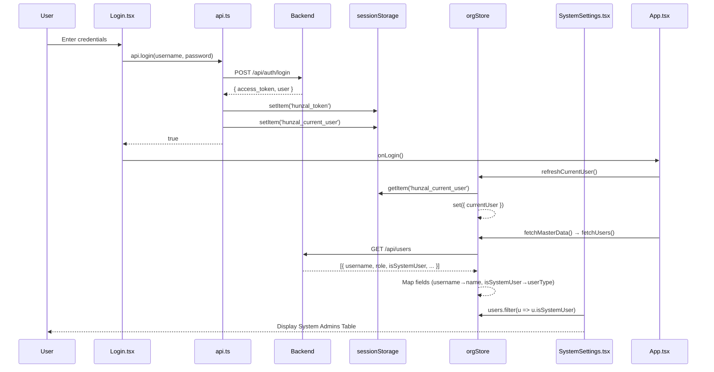

# User Management Mechanism - Complete Audit

## Status: ✅ 100% COMPLETE

All user management issues have been resolved. This document serves as the authoritative reference.

---

## System Overview



---

## Implementation Details

### 1. Login Flow (`api.ts`)

```typescript
async login(username, password) {
  const data = await response.json();
  if (data.access_token) {
    sessionStorage.setItem('hunzal_token', data.access_token);
    sessionStorage.setItem('hunzal_current_user', JSON.stringify(data.user)); // ✅ FIXED
  }
}

logout() {
  sessionStorage.removeItem('hunzal_token');
  sessionStorage.removeItem('hunzal_current_user'); // ✅ FIXED
}
```

### 2. Store State (`orgStore.ts`)

```typescript
// Initial state - loads from session
currentUser: (() => {
  const stored = sessionStorage.getItem('hunzal_current_user');
  if (stored) {
    const parsed = JSON.parse(stored);
    return { ...parsed, name: parsed.username, role: parsed.role };
  }
  return null;
})(),

// Actions
setCurrentUser: (user) => set({ currentUser: user }),
refreshCurrentUser: () => { /* reload from sessionStorage */ },

// fetchUsers with field mapping
fetchUsers: async () => {
  const data = await api.getUsers();
  const mappedUsers = data.map(u => ({
    ...u,
    name: u.name || u.username || 'Unknown',        // ✅ FIXED
    userType: u.isSystemUser ? 'SystemAdmin' : 'OrgUser', // ✅ FIXED
  }));
  set({ users: mappedUsers });
}
```

### 3. App Initialization (`App.tsx`)

```typescript
const { currentUser, refreshCurrentUser, fetchMasterData } = useOrgStore();

useEffect(() => {
  if (isAuthenticated) {
    refreshCurrentUser();  // ✅ FIXED - Load user from session
    fetchMasterData();
  }
}, []);

const handleLogin = () => {
  setIsAuthenticated(true);
  refreshCurrentUser();  // ✅ FIXED - Immediate load after login
  fetchMasterData();
};
```

### 4. System Admin Filter (`SystemSettings.tsx`)

```typescript
// Filter for System Admins table
users.filter(u => u.isSystemUser === true || u.userType === 'SystemAdmin') // ✅ FIXED
```

---

## Session Storage Keys

| Key | Purpose | Set By |
|-----|---------|--------|
| `hunzal_token` | JWT access token | `api.login()` |
| `hunzal_current_user` | Current user object (JSON) | `api.login()` |
| `hunzal_data_version` | Schema version for cache invalidation | `App.tsx` |

---

## Backend API Reference

### `POST /api/auth/login`

**Response:**
```json
{
  "access_token": "jwt-string",
  "token_type": "bearer",
  "user": {
    "id": "uuid",
    "username": "sysadmin",
    "role": "SystemAdmin",
    "organization_id": "uuid",
    "status": "Active",
    "employeeId": null
  }
}
```

### `GET /api/users`

**Response:**
```json
[
  {
    "id": "uuid",
    "username": "sysadmin",
    "role": "SystemAdmin",
    "status": "Active",
    "employeeId": null,
    "isSystemUser": true  // ← Key field for System Admin detection
  }
]
```

---

## Field Mapping (Backend → Frontend)

| Backend Field | Frontend Field | Notes |
|---------------|----------------|-------|
| `username` | `name` | Fallback if `name` not present |
| `isSystemUser: true` | `userType: 'SystemAdmin'` | System admin flag |
| `isSystemUser: false` | `userType: 'OrgUser'` | Regular org user |

---

## Files Modified

| File | Changes |
|------|---------|
| [api.ts](file:///d:/Python/HCM_WEB/services/api.ts) | `login()` stores user, `logout()` clears |
| [orgStore.ts](file:///d:/Python/HCM_WEB/store/orgStore.ts) | Added `currentUser`, `refreshCurrentUser`, field mapping in `fetchUsers` |
| [App.tsx](file:///d:/Python/HCM_WEB/App.tsx) | Uses `refreshCurrentUser` on init and login |
| [SystemSettings.tsx](file:///d:/Python/HCM_WEB/modules/SystemSettings.tsx) | Filter by `isSystemUser` |
| [types.ts](file:///d:/Python/HCM_WEB/types.ts) | Added `isSystemUser` to User interface, 'Creator' to role |

---

## RBAC Summary

| Role | Master Data | Positions | System Settings | Notes |
|------|-------------|-----------|-----------------|-------|
| **Creator** | ✅ Full | ✅ Full | ✅ Full | Equivalent to Super Admin |
| **Super Admin** | ✅ Full | ✅ Full | ✅ Full | System-wide access |
| **HR Admin** | ✅ Full | ✅ Full | ⚠️ Limited | HR-wide access |
| Manager | ❌ View | ❌ View | ❌ None | Department scope |
| Employee | ❌ None | ❌ None | ❌ None | Self-service only |

---

## Verification Checklist

- [x] Login stores user data in session
- [x] Logout clears user data from session
- [x] `currentUser` loads from session on app init
- [x] `refreshCurrentUser()` called after login
- [x] `fetchUsers()` maps `username` → `name`
- [x] `fetchUsers()` maps `isSystemUser` → `userType`
- [x] System Admin Users table filters by `isSystemUser`
- [x] User type includes `isSystemUser` field
- [x] RBAC checks include 'Creator' role
- [x] Project context documented in `.agent/PROJECT_CONTEXT.md`

---

**Last Updated:** 2026-01-09 14:44
