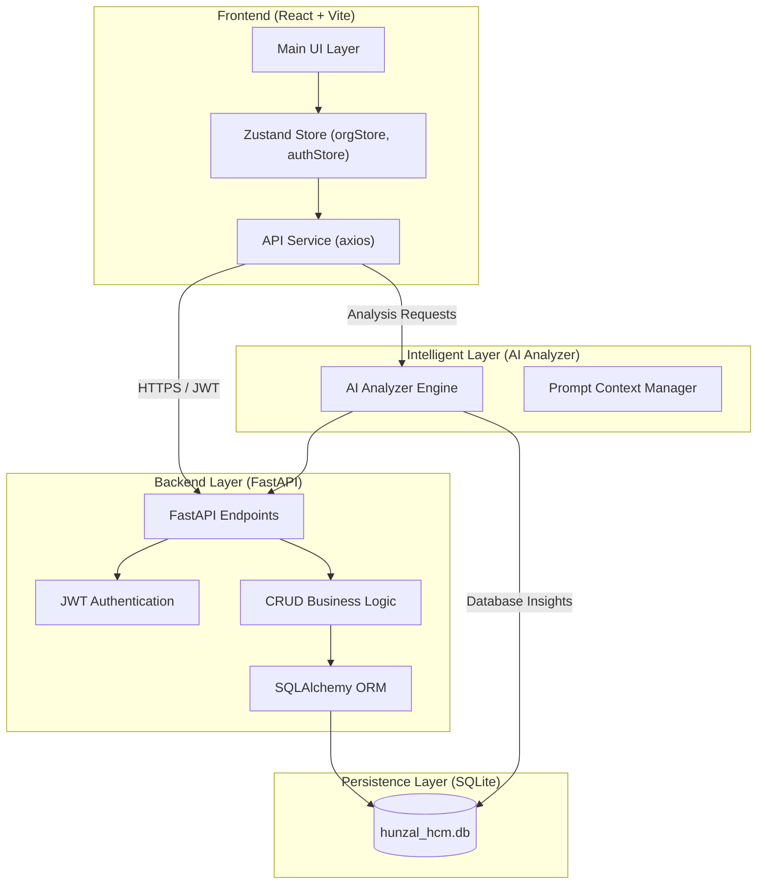
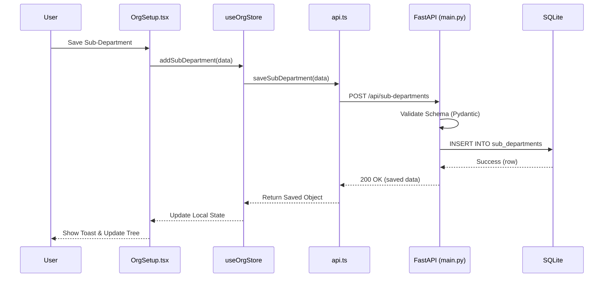

# System Architecture Diagram

This diagram illustrates the "Split Brain" architecture of Hunzal People OS, integrating the Modern Frontend, Robust Backend, and AI Analyzer layer.

## Data Flow: Sub-Department Persistence

