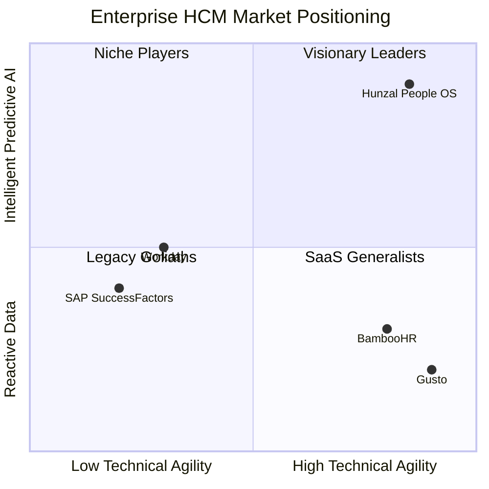
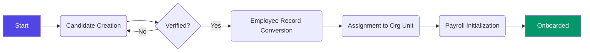

# Pitch Deck Visual Assets & Competitive Analysis

## 1. Competitive Positioning Quadrant
The "Enterprise HCM Quadrant" shows where Hunzal People OS stands relative to traditional and modern competitors.

| Attribute | Legacy HCM (SAP/Workday) | Modern SMB (BambooHR/Gusto) | Hunzal People OS |
| :--- | :--- | :--- | :--- |
| **Agility** | Low (Heavy implementation) | High (Plug-and-play) | **Extreme** (Proprietary Analyzer) |
| **Intelligence** | Reactive Reporting | Basic Analytics | **Predictive AI Insights** |
| **Complexity** | Extremely High | Low/Medium | **Enterprise-Grade yet Intuitive** |
| **Cost** | $$$$$ | $$ | **ROI-Focused SaaS** |

## 2. Feature Comparison Matrix

| Feature | Legacy Systems | Generic SaaS | Hunzal People OS |
| :--- | :--- :| :--- :| :--- :|
| **Multi-Tenant Org Wiring** | Complex | Basic | ✅ Built-in Enterprise Wiring |
| **Sub-Department Isolation** | Rigid | Missing | ✅ 100% Granular Persistence |
| **Built-in AI Analyzer** | Third-party only | Basic Bots | ✅ Integrated Gemini-Powered Layer |
| **Mobile-First Scroll Isolation** | Poor | Mixed | ✅ 100% CSS-Locked Professional Feel |
| **Zero TS Error Reliability** | N/A | Variable | ✅ Production-Grade Typescript |

## 3. High-Level Flow Diagram: Employee Onboarding

