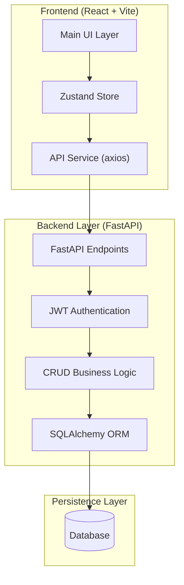

# 📘 PeopleOS Project Handbook

> **The Single Source of Truth for the PeopleOS Project.**
> _Last Updated: 2026-01-15_

---

## 🆕 Recent System Changes (v1.1)

### Designation Management

- **Department Association**: Field removed. Designations are now **Organization-Wide** by default.
- **Global Label**: Removed "Global" tagging; all designations apply to all departments unless restricted by policy.
- **Creation Flow**: Simplified to Name + Grade selection only.
- **Workflow Compatibility**: The optional field design is fully compatible with future "Pending Approval" status workflows for both Global and Departmental designations.

---

## 1. 📖 Project Overview

**PeopleOS** is a next-generation HCM platform designed to streamline workforce management. It combines a modern, responsive **React** frontend with a robust **Python (FastAPI)** backend, integrating AI capabilities.

### Key Features

- **Core HR**: Employee Lifecycle, Payroll, Attendance, Leaves.
- **Admin**: Granular RBAC, System Settings, Audit Logging.
- **AI Engine**: Predictive attrition models, workforce intelligence.
- **Security**: JWT Authentication, Role-Based Access Control, Encrypted Data.

### Tech Stack

| Component    | Technology                     | Description    |
| :----------- | :----------------------------- | :------------- |
| **Frontend** | React 18, TypeScript, Tailwind | Main UI        |
| **Backend**  | Python 3.10+, FastAPI          | API & Logic    |
| **Database** | SQLite (Dev) / PostgreSQL      | Persistence    |
| **State**    | Zustand                        | Frontend State |

---

## 2. 🏗️ Architecture

The system follows a "Split Brain" architecture separating UI, Logic, and AI.

### System Diagram



### Data Flow Example (Sub-Department Save)

1. **User** triggers action in `OrgSetup.tsx`
2. **UI** calls `useOrgStore.addSubDepartment()`
3. **Store** calls `api.saveSubDepartment()`
4. **Backend** validates schema (Pydantic)
5. **Database** inserts row
6. **Response** flows back to UI to update local state

---

## 3. 📜 Project Rules & Philosophy (The Golden Rules)

> **The Golden Rule:** Every change is a contract change.
> Who depends on this, and how do they learn about the change?

### The 10-Layer Checklist

1. **Database**: Update Migrations, Indexes, Constraints.
2. **Domain Logic**: Check Rules, Calcs, State, Validations.
3. **API Contract**: Update Schemas, Swagger, Docs.
4. **Frontend**: Update Forms, Validation, Permissions.
5. **Workflow**: Update Approval Chains, Notifications.
6. **Security**: "Should a manager see this?" (RBAC).
7. **Reporting**: Update Dashboards, ETL.
8. **Documentation**: Update Tech/Admin Docs.
9. **Testing**: Unit, Integration, Edge-cases.
10. **Deployment**: Test Migrations, Rollback Plan.

_If you can't tick all ten, you're not done._

---

## 4. 🔒 Security & Access Control

The system uses a **L0-L5 Role Hierarchy**.

### Role Matrix

| Level  | Role               | Type     | Key Scope                      |
| :----- | :----------------- | :------- | :----------------------------- |
| **L5** | **Root**           | System   | God Mode (Wildcard `*`)        |
| **L4** | **Super Admin**    | System   | Full Access (Wildcard `*`)     |
| **L3** | **SystemAdmin**    | System   | Config Only (No Business Data) |
| **L2** | **Business Admin** | Business | HR/Payroll (No System Config)  |
| **L1** | **Manager**        | Business | Team View Only                 |
| **L0** | **User**           | Business | Self-Service Only              |

### Segregation Principles

- **System Roles (L3-L5)** manage the _platform_.
- **Business Roles (L0-L2)** manage the _operations_.
- **NEVER Mix:** A SystemAdmin cannot view Payroll (Privacy). A BusinessAdmin cannot view API Keys (Security).

### Verification

- **Backend**: `check_permission()` decorator.
- **Frontend**: `<RoleGuard>` component and `useRBAC()` hook.
- **Database**: `role_permissions` table (seeded via `backend/seed_permissions.py`).

---

## 5. ⚙️ Environment & Configuration

### Standard Ports

| Env                | Port   | Usage          | Script                |
| :----------------- | :----- | :------------- | :-------------------- |
| **Frontend (Dev)** | `5173` | Hot Reload     | `npm run dev`         |
| **Backend (API)**  | `8000` | FastAPI Server | `./start_backend.bat` |
| **Prod Preview**   | `3000` | Build + Serve  | `npm run preview`     |

### File Locations

- **Env Vars**: `.env` (Project Root)
- **Database**: `backend/data/people_os.db` (or `hunzal_hcm.db`)
- **Frontend Config**: `vite.config.ts`

---

## 6. 🧪 Testing & Diagnostics

### Diagnostic Script

A `diagnostic-capture.js` script is available to auto-diagnose issues.

**How to Run:**

1. Open DevTools Console (F12)
2. Paste the diagnostic script
3. Run `DIAGNOSTIC.save()`
4. It checks: Token, LocalStorage, API Health, network errors.

### Manual Checks

- **Token Check**: `sessionStorage.getItem('people_os_token')`
- **Org Profile**: `localStorage.getItem('org_profile')`
- **Backend Health**: `curl http://localhost:8000/health`

---

## 7. 🚀 Deployment

### Pre-Deployment Checklist

1. **Migrations**: Check `alembic upgrade head`
2. **Tests**: Run `pytest` and `npm run test`
3. **Build**: Run `npm run build`
4. **Permissions**: Verify `python backend/seed_permissions.py`

### Production Start

1. **Backend**: `uvicorn backend.main:app --host 0.0.0.0 --port 8000`
2. **Frontend**: Serve the `dist` folder via Nginx or similar.

---

---

## 8. 📏 Standard Operating Procedures

### 8.1 💻 Coding Standards

**Frontend (React/TypeScript)**

- **Components**: PascalCase (e.g., `EmployeeList.tsx`)
- **Functions/Vars**: camelCase (e.g., `fetchData`)
- **Constants**: UPPER_SNAKE_CASE (e.g., `MAX_RETRIES`)
- **Structure**:
  ```text
  src/
  ├── modules/      # Feature-based groupings
  ├── components/   # Shared UI components
  ├── services/     # API calls
  ├── store/        # Zustand stores
  └── types/        # shared types
  ```

**Backend (Python/FastAPI)**

- **Files/Vars**: snake_case (e.g., `employee_service.py`)
- **Classes**: PascalCase (e.g., `EmployeeResponse`)
- **Type Hints**: **Mandatory** for all function arguments and returns.
- **Pydantic**: Use `schemas` for all request/response validation.

### 8.2 🔀 Git Standards

**Branching Strategy**

- `main` / `master`: Production-ready code.
- `dev`: Integration branch.
- `feature/name`: New features (e.g., `feature/payroll-calc`).
- `fix/issue`: Bug fixes (e.g., `fix/login-error`).

**Commit Messages (Conventional Commits)**

- `feat: add new payroll calculator`
- `fix: resolve null pointer in user profile`
- `docs: update API documentation`
- `refactor: simplify auth logic`
- `chore: update dependencies`

### 8.3 🔌 API Standards

**URL Structure**

- Resource-based: `/api/resources` (Plural)
- Hierarchy: `/api/departments/{id}/employees`
- **Never** use verbs in URLs (Bad: `/api/getEmployees`).

**HTTP Methods**

- `GET`: Retrieve data (Safe, Idempotent).
- `POST`: Create new data (Not Idempotent).
- `PUT`: Full update (Idempotent).
- `PATCH`: Partial update.
- `DELETE`: Remove data.

**Status Codes**

- `200 OK`: Success (GET, PUT, PATCH).
- `201 Created`: Success (POST).
- `204 No Content`: Success (DELETE).
- `400 Bad Request`: Validation error.
- `401 Unauthorized`: Missing/Invalid token.
- `403 Forbidden`: Authenticated but no permission.
- `404 Not Found`: Resource doesn't exist.
- `500 Server Error`: Unhandled exception.

### 8.4 🛡️ Error Handling & Logging

**Backend**

- **Exceptions**: Use `HTTPException` with clear detail.
- **Logging**: Use standard `logging` module.
  - `INFO`: Normal operations.
  - `WARNING`: Unexpected but handled.
  - `ERROR`: System failure.
- **PII Rule**: **NEVER** log passwords, tokens, or sensitive personal data.

**Frontend**

- **Toast Notifications**:
  - Success: Green (Action completed).
  - Error: Red (Action failed).
- **Console**: Clean up `console.log` before merge. Use `console.error` for actual errors.

---

_© 2026 PeopleOS Team_
